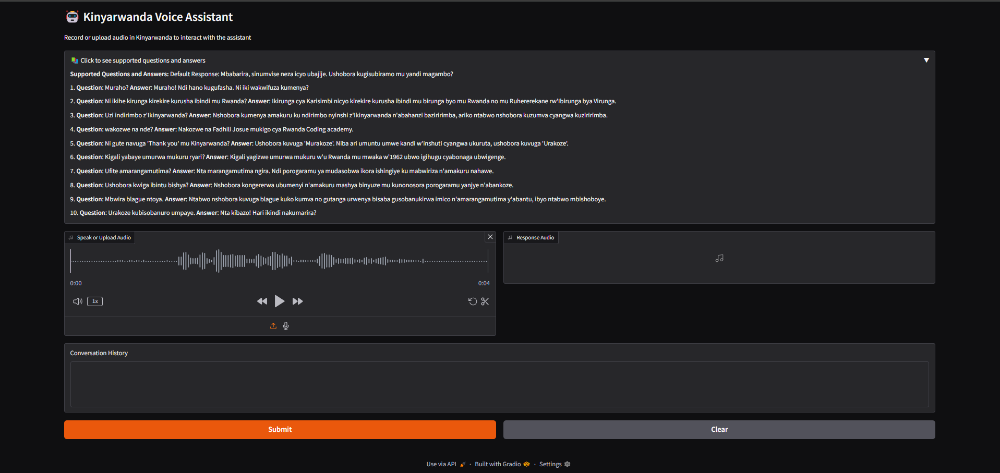

# Kinyarwanda Voice Assistant 🤖

An intelligent voice assistant that supports natural conversation in Kinyarwanda, built using speech recognition, fuzzy NLP matching, and text-to-speech. Created for the Intelligent Robotics course.

## 🔑 Key Features
- 🎙️ Speech-to-text using **KinyaWhisper**
- 🧠 Context-aware response generation via **fuzzy logic**
- 📢 Kinyarwanda **text-to-speech**
- 🔇 Advanced **noise reduction**
- 🗣️ Voice Activity Detection (VAD)
- 📊 Conversation analytics and web interface via **Gradio**

## 🛠️ Tech Stack
- **AI & NLP**: Hugging Face, FuzzyWuzzy, Python-Levenshtein  
- **Audio**: Librosa, Soundfile, WebRTC VAD  
- **Interface**: Gradio  
- **Optimization**: Noisereduce, FFmpeg  

## 🚀 Quick Start
```bash
git clone https://github.com/FADHILI-Josue/Talk2AI-kinyarwanda.git
cd Talk2AI-kinyarwanda
python -m venv .venv
source .venv/bin/activate  # or .\.venv\Scripts\activate on Windows
pip install -r requirements.txt
copy .env.example .env
# add you token from hugging face
python main.py
```
Then open [http://localhost:7860](http://localhost:7860)

## ⚙️ Configuration
- Customize questions/responses in `nlp_mapping.json`
- Sample recordings in `/sample_inputs` (supports WAV)

## 💡 Interface Usage
- Record/upload audio
- Click **Submit**
- Listen to the reply & view history (transcription, matched Q&A)


## 📋 Example
| Input          | Matched Q       | Response                                  |
|----------------|------------------|--------------------------------------------|
| muraho       | muraho?          | Muraho! Ndi hano kugufasha. Ni iki wakwifuza kumenya?                     |
| wakozwe na nde | wakozwe na nde?   | Nakozwe na Fadhili Josue mukigo cya Rwanda Coding academy.     |